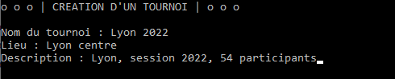
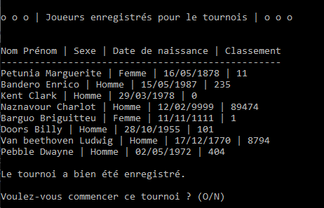

# A PROPOS

**OpenClassrooms - Développeur d'application Python - Projet #4: Développez un programme logiciel en Python**

_Testé sous Windows 10 et Python 3.10.2_

# Objectifs
Programme de gestion de tournois d'échecs HORS LIGNE, permettant de :
- Créer un tournoi et y ajouter 8 participants
- Reprendre un tournoi à n'importe quel moment
- Ajouter des joueurs
- Modifier des joueurs
- Supprimer des joueurs
- Afficher des rapports sur les tournois, joueurs, etc. 

# Comankonfè (Windows)
### Récupération d'une copie du "dépôt"

- `git clone https://github.com/munchou/OpenClassrooms-Project-4.git`

### Création et activation de l'environnement virtuel
(Python doit avoir été installé)

- `python -m venv DOSSIER` où DOSSIER est le nom du dossier où sera créé l'environnement.
- Activation : `env\Scripts\activate`
    
### Installation des modules nécessaires

- `pip install -r requirements.txt`

### Pour lancer le programme

- `python main.py` ou `python3 main.py`

### Pour obtenir le rapport Flake8
Flake8 va scanner le fichier "main" ainsi que les fichiers se trouvant dans les dossiers "controller", "models" et "views". Le rapport sera exporté au dans le fichier "index.html" situé dans le dossier "flake8-report".
- `flake8 --format html --htmldir flake8_report --max-line-length 119 main.py controllers models views`

### Utilisation du programme
Au lancement du programme sera affiché le menu principal :

Création d'un tournoi où il faut saisir le nom, le lieu et éventuellement une description :
(note : les saisies ne sont pas contraignantes donc n'importe quoi peut être entré)

Une fois ces informations entrées, il faut choisir 8 joueurs parmi la liste des joueurs disponibles (minimum 8).
S'il y a 7 joueurs ou moins, vous serez invité à en créer de nouveaux.

Récapitulatif des joueurs enregistrés pour le tournoi et sauvegarde du tournoi.
Il est possible de directement commencer le tournoi ou de retourner au menu principal et de reprendre plus tard.
Dans le cas où on commence le tournoi :

Les matchs du round courant sont affichés. Confirmer la fin du round permet la saisie des scores en choisissant le vainqueur ou un match nul. 

Après avoir distribué les points, le tournoi est mis à jour et vous pouvez retourner au menu principal ou quitter le programme.

En cas de reprise de tournoi, les tournois NON TERMINÉS sont affichés.

Le tournoi reprend là où il a été laissé. Dans ce cas précis, il reprend après la fin du round1, à la création du round 2 :

Ajout d'un nouveau joueur.
Il est important de noter que les saisies sont CONTRAIGNANTES, vous ne pouvez pas mettre n'importe quoi.
ID : 2 lettres et 5 chiffres
Nom et prénom : lettres uniquement, minimum 2
Date de naissance : format jjmmaaaa où les jours et mois doivent exister. Pas de contrainte pour la date, donc attention.
Sexe : H ou F
Classement : chiffres uniquement

Modification d'un joueur.
Il est possible de mettre à jour certaines informations d'un joueur. Le choix du joueur se fait via son ID, ce qui limite le risque d'erreurs.
Peuvent être mis à jour le nom et prénom, date de naissance, sexe et classement.

Suppression d'un joueur.
Il est possible de supprimer un joueur. Le choix du joueur se fait via son ID, ce qui limite le risque d'erreurs.

Affichage de rapports.
Il est possible d'afficher différentes informations :

Exemple de rapport : "Afficher les rounds et matchs d'un tournoi", sélection du tournoi 7.

### 